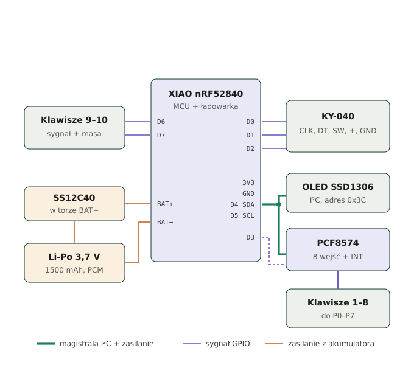

# Makropad BLE — 10 klawiszy MX + enkoder

Bezprzewodowy makropad na **Seeed XIAO nRF52840**, w drukowanej obudowie
109,8 × 87,75 × 25,4 mm. Dziesięć przełączników MX w rastrze 20 mm, wyświetlacz
OLED 0,91", enkoder obrotowy KY-040 i zasilanie z ogniwa Li-Po 1500 mAh.



## Od czego zacząć

1. **[docs/03-instrukcja-montazu.md](docs/03-instrukcja-montazu.md)** — pełna instrukcja
   krok po kroku, 20 kroków, pisana dla osoby bez doświadczenia w lutowaniu.
   Wersja do druku: [print/instrukcja-montazu.pdf](print/instrukcja-montazu.pdf) (18 stron A4).
2. **[hardware/bom.csv](hardware/bom.csv)** — lista zakupowa.
3. **[hardware/pinout.csv](hardware/pinout.csv)** — mapa pinów, gdyby coś było niejasne.
4. **[docs/06-architektura-i-json.md](docs/06-architektura-i-json.md)** — architektura
   web configuratora: struktura JSON, protokół Web Serial, plan firmware.
   **[web/index.html](web/index.html)** — configurator (Krok 1 UI + Krok 2 Web Serial),
   otwórz w Chrome/Edge/Operze.

## Status oprogramowania

Elektronika i obudowa są gotowe do montażu (patrz sekcja wyżej). Warstwa
softwarowa ma za sobą wszystkie **3 zaplanowane kroki**:

| Krok | Co obejmuje | Status |
|---|---|---|
| 1. Architektura, JSON, mockup UI | `docs/06-architektura-i-json.md`, `web/index.html` | ✅ gotowe |
| 2. Frontend — realna integracja Web Serial API | `web/index.html`, `web/protocol.js` | ✅ gotowe — połączenie, odczyt/zapis configu, log komunikacji; zweryfikowane symulowanym urządzeniem (bez fizycznego XIAO, bo firmware go jeszcze nie implementował) |
| 3. Firmware — BLE/USB HID, logika makr, warstwy | `firmware/arduino/makropad_firmware/` | ✅ kod gotowy — **ale niekompilowany w środowisku, w którym powstał** (brak arduino-cli). Logika makr zweryfikowana symulacją + częściowym sprawdzeniem kompilatorem C++; pierwsze wgranie na sprzęt prawdopodobnie wymaga paru drobnych poprawek nazw metod bibliotek. Szczegóły: `docs/06-architektura-i-json.md` §9 i `firmware/README.md` |

## Wdrożenie web configuratora (GitHub Pages)

Strona jest w `web/index.html` — celowo **nie** w `/docs`, bo tam już jest
dokumentacja montażu w Markdown, a domyślny builder Pages (Jekyll) próbowałby
ją przetworzyć razem ze stroną. Zamiast tego `.github/workflows/deploy-pages.yml`
buduje i wdraża Pages bezpośrednio z `web/` przy każdym pushu.

Jednorazowa konfiguracja w repo na GitHubie:

1. **Settings → Pages → Build and deployment → Source** → ustaw **GitHub Actions**
   (nie "Deploy from a branch").
2. Zrób push do `main` (albo uruchom workflow ręcznie z zakładki *Actions* →
   *Wdrożenie web configuratora na GitHub Pages* → *Run workflow*).
3. Adres strony pojawi się w Settings → Pages oraz w logu joba (`page_url`).

Web Serial API wymaga HTTPS — adres `https://<user>.github.io/<repo>/` to
spełnia od razu, bez dodatkowej konfiguracji.

## Struktura projektu

```
makropad-ble/
├─ README.md
├─ requirements.txt
├─ .github/
│  └─ workflows/
│     └─ deploy-pages.yml            wdraża web/ na GitHub Pages przy push
├─ docs/
│  ├─ 01-analiza-obudowy.md          wymiary i otwory odczytane z plików STL
│  ├─ 02-elektronika-i-piny.md       topologia, mapa pinów, adresy I²C, firmware
│  ├─ 03-instrukcja-montazu.md       pełna instrukcja, 20 kroków
│  ├─ 04-wiazka-i-otwieranie.md      19 żył przez podział obudowy, pętla serwisowa
│  ├─ 05-rozwiazywanie-problemow.md  objaw → co sprawdzić
│  └─ 06-architektura-i-json.md      architektura configuratora, schemat JSON, protokół
├─ hardware/
│  ├─ bom.csv                        lista części, materiałów i narzędzi
│  ├─ pinout.csv                     przypisanie pinów XIAO i PCF8574
│  ├─ lista-przewodow.csv            kolory, sztuki, długości
│  └─ diagrams/                      5 rysunków SVG (edytowalne, np. w Inkscape)
├─ firmware/
│  ├─ README.md                      konfiguracja Arduino IDE
│  └─ arduino/
│     ├─ i2c_scanner/                sprawdzenie magistrali
│     ├─ makropad_test/              test wszystkich klawiszy i enkodera (bez HID/BLE)
│     └─ makropad_firmware/          firmware docelowy: BLE/USB HID, makra, warstwy, flash
├─ web/
│  ├─ index.html                     configurator: UI (Krok 1) + Web Serial API (Krok 2)
│  ├─ protocol.js                    ramki/parsowanie protokołu z docs/06 §4 (bez DOM)
│  └─ protocol.test.mjs              testy protocol.js — `node --test web/protocol.test.mjs`
├─ cad/                              tu wrzuć Dol.stl i Lid_final.stl
├─ print/                            instrukcja w HTML i PDF
└─ tools/
   ├─ analiza_stl.py                 przelicza wymiary obudowy z STL-i
   ├─ extract_svg.py                 wycina rysunki z HTML do osobnych plików
   ├─ html2md.py                     konwersja instrukcji HTML → Markdown
   └─ render_pdf.py                  składa instrukcję do PDF
```

## Skrót techniczny

| | |
|---|---|
| Mikrokontroler | Seeed XIAO nRF52840 (BLE, wbudowana ładowarka Li-Po) |
| Wejścia | 8 klawiszy przez PCF8574 (`0x20`), 2 klawisze wprost na `D6`/`D7` |
| Enkoder | KY-040 na `D0`/`D1`/`D2` — bezpośrednio, z pominięciem ekspandera |
| Wyświetlacz | SSD1306 0,91" 128 × 32, I²C `0x3C` |
| Przerwanie | `INT` z PCF8574 na `D3` — pozwala uśpić procesor między naciśnięciami |
| Zasilanie | Li-Po LP803450 1500 mAh, wyłącznik SS12C40 w torze `BAT+` |
| Piny wolne | `D8`, `D9`, `D10` |
| Żył przez podział obudowy | 19 |

## Rzeczy, o których łatwo zapomnieć

- **Akumulator podłączasz na samym końcu**, po teście na USB. Przewodów Li-Po nigdy nie
  tniesz obu naraz — po jednym, każdy koniec od razu zaklejony.
- **Zworki adresowe PCF8574 są zdjęte**, więc A0–A2 trzeba przylutować do GND, inaczej
  adres jest nieprzewidywalny.
- **W obudowie nie ma otworu na USB-C** — ładowanie wymaga rozkręcenia, chyba że
  dorobisz wycięcie w lewej ściance.
- **Wyłącznik przerywa plus akumulatora**, więc w pozycji OFF urządzenie się nie ładuje.
- **Płyta pod klawisze ma 2,4 mm** zamiast typowych 1,5 mm — zatrzaski MX mogą nie kliknąć.

## Odtworzenie plików

```bash
pip install -r requirements.txt
playwright install chromium

python3 tools/analiza_stl.py     # wymiary obudowy (wymaga STL-i w cad/)
python3 tools/extract_svg.py     # rysunki SVG z instrukcji HTML
python3 tools/html2md.py         # instrukcja HTML -> Markdown
python3 tools/render_pdf.py      # instrukcja HTML -> PDF
```

Instrukcja jest edytowana w `print/instrukcja-montazu.html` — to plik źródłowy.
Markdown i PDF są z niego generowane, więc poprawki wprowadzaj w HTML-u i uruchom
`html2md.py` oraz `render_pdf.py`.
