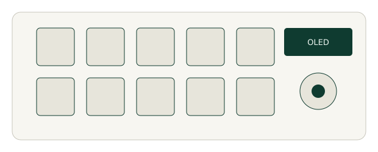
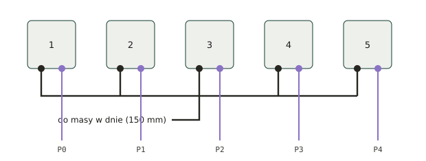

Instrukcja montażu · wersja 1.0

# Makropad BLE 10 klawiszy + enkoder

Krok po kroku, od rozpakowania części do zamknięcia obudowy. Napisane dla osoby, która pierwszy raz bierze do ręki lutownicę — każdy krok ma opis wykonania, sposób sprawdzenia i najczęstszy błąd.

## Zanim weźmiesz lutownicę

> **Akumulator litowo-polimerowy to jedyny element, który może zrobić Ci krzywdę.** Zapamiętaj cztery zasady i trzymaj się ich bez wyjątku:
>
> - Akumulator podłączasz **na samym końcu** — dopiero gdy cały układ przejdzie test na USB. Do tego momentu leży w szufladzie, z dala od stanowiska.
> - **Nigdy nie dotykaj lutownicą przewodów akumulatora, gdy są ze sobą połączone.** Jeśli musisz je skrócić, tniesz **po jednym**, a odcięty koniec od razu zaklejasz taśmą.
> - Czerwony i czarny nie mogą się zetknąć nawet na ułamek sekundy. Zwarcie ogniwa 1500 mAh to iskra, dym i realne ryzyko pożaru.
> - Jeśli ogniwo spuchnie, zrobi się gorące albo zacznie dziwnie pachnieć — odłącz je, wynieś na zewnątrz na niepalne podłoże i nie używaj więcej.

Poza tym: lutownica ma na grocie 320–350 °C i wygląda tak samo, gdy jest zimna i gdy jest gorąca. Odkładaj ją zawsze na podstawkę, nigdy na blat. Pracuj w przewietrzanym pomieszczeniu — dym z kalafonii nie jest trujący, ale drażni oczy i drogi oddechowe.

### Słowniczek — pięć pojęć, które wystarczą

| Pojęcie                   | Co to znaczy w praktyce                                                                                                                                               |
|---------------------------|-----------------------------------------------------------------------------------------------------------------------------------------------------------------------|
| **GND / masa**            | Wspólny „minus" całego układu. Wszystkie elementy muszą być do niej podpięte, inaczej nic nie działa. W tym projekcie masa jest czarna.                               |
| **3V3**                   | Zasilanie 3,3 V, czyli „plus" dla modułów. Wychodzi z pinu `3V3` płytki XIAO. W tym projekcie czerwony.                                                               |
| **I²C**                   | Dwa przewody (`SDA` i `SCL`), po których XIAO rozmawia z wyświetlaczem i ekspanderem. Oba układy wiszą na tej samej parze — to normalne, każdy ma swój numer (adres). |
| **Pad / pole lutownicze** | Metalowy kwadracik albo otwór na płytce, do którego lutujesz przewód. Obok zwykle jest napisana nazwa sygnału.                                                        |
| **Cynowanie**             | Pokrycie gołego końca przewodu cyną, zanim przylutujesz go do płytki. Bez tego przewód się strzępi i lut się nie chwyta.                                              |

### Lista części

| \#  | Element                                                                             | Ile    | Uwagi                                              |
|-----|-------------------------------------------------------------------------------------|--------|----------------------------------------------------|
| 1   | Seeed XIAO nRF52840 (BLE)                                                           | 1      | Mózg całości, ma wbudowaną ładowarkę Li-Po         |
| 2   | Moduł PCF8574                                                                       | 1      | Bez zworek i goldpinów — tak jak masz              |
| 3   | Wyświetlacz OLED 0,91" SSD1306 I²C                                                  | 1      | 128 × 32 piksele, adres 0x3C                       |
| 4   | Enkoder KY-040                                                                      | 1      | Bez goldpinów                                      |
| 5   | Przełączniki mechaniczne MX                                                         | 10     | Do wycięć 14 × 14 mm                               |
| 6   | Keycapy                                                                             | 10     | Raster w obudowie to 20 mm                         |
| 7   | Przełącznik suwakowy SS12C40                                                        | 1      | Trzy nóżki, używasz dwóch                          |
| 8   | Akumulator Li-Po LP803450 1500 mAh                                                  | 1      | Z zabezpieczeniem PCM i wtykiem JST 2,54           |
| 9   | Wydruk: Dol.stl i Lid_final.stl | 1 kpl. | Sprawdź, czy wycięcia 14 × 14 mm nie są zarośnięte |

### Materiały do dokupienia

| Materiał                                      | Ile       | Po co                                                                           |
|-----------------------------------------------|-----------|---------------------------------------------------------------------------------|
| Przewód silikonowy 30 AWG, min. 4 kolory      | ok. 5 m   | Cała wiązka. Silikon, nie PVC — musi być miękki, bo inaczej sam otworzy obudowę |
| Przewód silikonowy 26 AWG, czerwony i czarny  | 2 × 20 cm | Ewentualne przedłużenie akumulatora i wyłącznik                                 |
| Wtopki mosiężne M3 (otwór 4,2 mm, dł. 4–5 mm) | 2         | Gwint w wydruku pod śruby                                                       |
| Śruby M3 × 10 mm z łbem stożkowym             | 2         | Skręcenie obudowy                                                               |
| Koszulki termokurczliwe 1,5 mm i 2,5 mm       | po 30 cm  | Izolacja połączeń, zwłaszcza przy akumulatorze                                  |
| Taśma Kaptonowa lub izolacyjna, wąska         | 1 rolka   | Sklejanie wiązki w płaską taśmę                                                 |
| Gniazdo JST XH 2,54 2-pin z przewodami        | 1         | Opcjonalnie — żeby dało się odpiąć akumulator                                   |
| Kondensatory ceramiczne 100 nF                | 2         | Opcjonalnie — wygładzają sygnał z enkodera                                      |
| Klej na gorąco / taśma dwustronna             | —         | Mocowanie modułów i kotwiczenie wiązki                                          |

### Narzędzia

Lutownica z cienkim grotem (najlepiej z regulacją temperatury), cyna 0,5–0,7 mm z topnikiem, ściągacz izolacji lub ostry nożyk, pęseta, obcinaczki boczne, **multimetr z brzęczykiem** (to nie jest opcja — bez niego szukanie błędu potrwa godziny), zapalniczka lub opalarka do koszulek, pistolet na klej, kabel USB-C **z transmisją danych** (kabel „tylko do ładowania" nie zadziała i zmarnujesz na to pół wieczoru).

## Jak to ma być połączone

Zanim zaczniesz, przejrzyj oba rysunki. Nie musisz ich rozumieć w całości — wrócisz do nich przy konkretnych krokach. Ważne, żebyś wiedział, że one tu są.

Rysunek 1. Schemat połączeń. Gruba zielona linia to cztery żyły biegnące razem: 3V3, GND, SDA i SCL.

Rysunek 2. Rozmieszczenie w obudowie — współrzędne odczytane z Twoich plików STL. Białe kółka to słupki na śruby M3.

## Etap 1 — Przygotowanie

### Krok 1 — Przygotuj stanowisko

- Znajdź stół, na którym nic Cię nie goni przez najbliższe kilka godzin. Najlepiej twardy, jasny blat — drobne części lubią znikać w dywanie.
- Połóż podkładkę niepalną: kawałek płytki ceramicznej, blacha do pieczenia albo choćby gruby karton. Kropla cyny spadająca z grota przepala obrus.
- Ustaw lutownicę na **320 °C**, jeśli ma regulację. Podstawkę połóż po tej stronie, którą trzymasz lutownicę.
- **Akumulator odłóż do innego pokoju albo do szuflady.** Wróci dopiero w kroku 16.

> **Sprawdź:** na blacie masz wolne miejsce wielkości kartki A4. Jeśli nie masz, posprzątaj — będziesz operował dwiema połówkami obudowy połączonymi wiązką i potrzebujesz przestrzeni.

### Krok 2 — Sprawdź komplet i przymierz na sucho

- Rozłóż wszystkie części z listy i policz je. Brakujący przewód znajdziesz teraz w 30 sekund, a za trzy godziny — nigdy.
- Weź jeden przełącznik MX i wciśnij go palcem w dowolne wycięcie w pokrywie. Ma wejść z lekkim oporem. Jeśli w ogóle nie wchodzi, wydruk trzeba lekko przeszlifować pilnikiem igłowym po wewnętrznych krawędziach wycięcia.
- Włóż OLED od spodu w kołnierz, a enkoder wsuń trzpieniem w okrągły otwór. Sprawdź, czy siedzą — nic nie przykręcaj i nie klej.
- Wyjmij wszystko z powrotem. To była tylko próba.

> **Częsty błąd:** pominięcie tego kroku i odkrycie w kroku 14, że przełącznik nie wchodzi — a wtedy masz już do niego przylutowane przewody i szlifowanie jest koszmarem.

### Krok 3 — Wtop gwinty M3 w dno

W dnie są dwa kwadratowe słupki z otworami 4,2 mm. To nie są otwory na wkręty — to gniazda na mosiężne wtopki, które dadzą Ci prawdziwy gwint w plastiku.

- Postaw wtopkę na otworze, szerszym końcem do góry.
- Ustaw lutownicę na **250 °C** (niżej niż do lutowania) i dotknij grotem środka wtopki, naciskając **bardzo delikatnie**, pionowo w dół. Wtopka zacznie sama tonąć w plastiku.
- Gdy jej górna krawędź zrówna się z powierzchnią słupka — zabierz lutownicę. Nie wciskaj głębiej.
- Poczekaj 30 sekund, aż plastik ostygnie. Dopiero wtedy dotykaj.

> **Sprawdź:** wkręć na próbę śrubę M3. Powinna wchodzić gładko i prostopadle. Jeśli wtopka weszła krzywo, podgrzej ją ponownie i popraw, dociskając z boku.

> **Nie masz wtopek?** Nie zastąpisz ich wkrętem do plastiku — otwór 4,2 mm jest na to o wiele za duży. Alternatywa to wklejenie nakrętki M3 kroplą kleju epoksydowego, ale wtopka jest zdecydowanie lepsza.

### Krok 4 — Wciśnij 10 przełączników MX w pokrywę

Przełączniki wciskasz **od góry** pokrywy, tak żeby nóżki wystawały do środka obudowy.

- **Ustaw wszystkie tak samo** — obie nóżki mają być bliżej górnej krawędzi pokrywy (tej z OLED-em). To nie ma znaczenia elektrycznego, ale dzięki temu wszystkie luty będą w jednej linii i wiązka wyjdzie równa.
- Wciskaj kciukami, równomiernie, prosto w dół. Przełącznik ma wejść na całą głębokość, aż jego obudowa dotknie płyty.
- Płyta w Twoim wydruku ma 2,4 mm grubości, a zatrzaski MX są robione pod 1,5 mm — **mogą nie kliknąć**. To normalne. Przełącznik trzyma się wtedy ciernie.
- Jeśli któryś się rusza, kapnij od spodu odrobinę kleju na gorąco w narożnik jego obudowy. Nie na nóżki i nie na środek.

> **Sprawdź:** obróć pokrywę i potrząśnij lekko. Nic nie wypada, wszystkie nóżki sterczą w tę samą stronę.

### Krok 5 — Potnij i ocynuj przewody

Kolory nie są ozdobą — za trzy godziny będą jedyną rzeczą, która pozwoli Ci rozpoznać, co jest czym. Trzymaj się ich sztywno.

| Do czego                          | Kolor                          | Sztuk | Długość |
|-----------------------------------|--------------------------------|-------|---------|
| Sygnały klawiszy 1–8 (do PCF8574) | biały / dowolny jasny          | 8     | 150 mm  |
| Sygnały klawiszy 9–10 (do XIAO)   | fioletowy                      | 2     | 170 mm  |
| Łańcuch masy między klawiszami    | czarny                         | 9     | 30 mm   |
| Masa klawiszy do dna              | czarny                         | 1     | 150 mm  |
| OLED: 3V3, GND, SDA, SCL          | czerw. / czar. / nieb. / żółty | 4     | 170 mm  |
| KY-040: +, GND, CLK, DT, SW       | czerw. / czar. / 3 × fiolet    | 5     | 170 mm  |
| Wyłącznik SS12C40                 | pomarańczowy 26 AWG            | 2     | 130 mm  |
| PCF8574 do XIAO (oba w dnie)      | czerw./czar./nieb./żółty/ziel. | 5     | 70 mm   |

- Ściągnij izolację na **3 mm** z obu końców. Nie więcej — długi goły odcinek to gotowe zwarcie.
- **Ocynuj każdy koniec:** dotknij grotem żyłki, policz „raz, dwa", podaj odrobinę cyny. Żyłka ma zrobić się srebrna i sztywna, nie ma się rozłazić na włoski.
- Posortuj wiązki gumką recepturką albo klipsem, opisz je kartkami. Naprawdę warto.

> **Częsty błąd:** cynowanie zbyt długo. Silikon się cofa i odsłania kolejny centymetr żyłki. Trzy sekundy na koniec, nie więcej.

## Etap 2 — Lutowanie modułów na stole

Wszystko poniżej robisz z modułami leżącymi luzem na blacie, przed włożeniem ich do obudowy. Po włożeniu nie będzie już do nich dostępu.

### Krok 6 — Ustaw adres PCF8574 i przylutuj do niego przewody

PCF8574 ma na magistrali swój numer — adres. Zależy on od trzech punktów opisanych `A0`, `A1`, `A2` (tam, gdzie były zworki). Skoro zworek już nie ma, punkty te „wiszą w powietrzu" i adres jest niepewny. Ustalmy go raz a dobrze.

- Odetnij trzy krótkie kawałki czarnego przewodu (po 15 mm), ocynuj i połącz nimi **A0, A1 oraz A2 z polem GND** na tym samym module. Adres modułu to teraz **0x20**.
- Przylutuj pięć przewodów o długości 70 mm: VCC (czerwony), GND (czarny), SDA (niebieski), SCL (żółty), INT (zielony).
- Przylutuj osiem białych przewodów po 150 mm do pól P0 … P7. Podpisz je taśmą: 1, 2, 3 … 8.

> **Sprawdź multimetrem:** brzęczyk między A0 a GND — ma piszczeć. Między VCC a GND — **nie może** piszczeć. Jeśli piszczy, masz zwarcie i musisz je znaleźć teraz, nie później.

> **Uwaga na wersję układu.** Jeśli na kostce jest napis PCF8574**A**, adresy są inne (0x38–0x3F) i jeden z nich koliduje z wyświetlaczem. Zweryfikujesz to skanerem w kroku 14 — na razie po prostu zerknij na napis i zapamiętaj.

### Krok 7 — Przylutuj przewody do wyświetlacza OLED

- Wyświetlacz ma cztery pola, zwykle w kolejności GND · VCC · SCL · SDA. **Przeczytaj napisy na swoim egzemplarzu** — bywają inne kolejności i to jest najczęstsza przyczyna „nie działa".
- Przylutuj cztery przewody po 170 mm zgodnie z kolorami: GND czarny, VCC czerwony, SCL żółty, SDA niebieski.
- Lutuj szybko, po 2–3 sekundy na pole. Szkło wyświetlacza nie lubi długiego grzania.
- Kapnij kroplę kleju na gorąco na same przewody tuż obok lutów. To zabezpieczy je przed wyrwaniem pól przy szarpnięciu.

> **Sprawdź:** pociągnij delikatnie za każdy przewód. Żaden się nie rusza, żadne pole nie odchodzi od płytki.

### Krok 8 — Przylutuj przewody do enkodera KY-040

- Pięć pól: CLK · DT · SW · + · GND. Przylutuj pięć przewodów po 170 mm.
- Kolory: + czerwony, GND czarny, a CLK, DT, SW fioletowe. Podpisz te trzy fioletowe taśmą, bo są nie do rozróżnienia.
- **Opcjonalnie, ale polecam:** przylutuj dwa kondensatory 100 nF — jeden między CLK a GND, drugi między DT a GND, bezpośrednio na polach modułu. Kondensator nie ma biegunowości, więc nie da się go wlutować odwrotnie. Bez nich enkoder będzie czasem przeskakiwał o dwa kliknięcia.

### Krok 9 — Przygotuj wyłącznik i przewody akumulatora

Wyłącznik SS12C40 ma trzy nóżki. Środkowa to wspólna, a z dwóch skrajnych używasz **tylko jednej** — dowolnej.

- Przylutuj pomarańczowy przewód 130 mm do **środkowej** nóżki i drugi taki sam do **jednej skrajnej**.
- Trzecią, nieużywaną nóżkę **odizoluj**: nasuń na nią kawałek koszulki termokurczliwej i zgrzej. Albo odetnij ją obcinaczkami przy samej obudowie wyłącznika.
- Teraz akumulator — **wciąż go nie podłączasz**, przygotowujesz tylko stronę urządzenia. Najbezpieczniej: weź gniazdo JST XH 2,54 z przewodami i to **jego** przewody wlutujesz do XIAO. Akumulator będzie się wtedy wpinał i wypinał, a Ty nigdy nie dotkniesz lutownicą jego ogniwa.
- Jeśli gniazda nie masz i musisz odciąć wtyk z akumulatora: **odetnij czerwony przewód, natychmiast zaklej jego koniec taśmą, dopiero potem tnij czarny.** Nigdy oba naraz jednym cięciem obcinaczek — to zwarcie.

> **To jest ten moment, w którym ludzie robią sobie krzywdę.** Jeśli choć przez chwilę zawahasz się przy przewodach akumulatora — kup gniazdo JST i nie tnij niczego. Kosztuje kilka złotych.

### Krok 10 — Przylutuj wszystko do płytki XIAO

To najgęstsza część roboty. XIAO jest mały, a pola leżą blisko siebie — pracuj powoli i po jednym przewodzie.

| Pole na XIAO | Co do niego idzie                                                                                                  |
|--------------|--------------------------------------------------------------------------------------------------------------------|
| 3V3          | Czerwony do PCF8574 (70 mm). Do tego samego pola dojdą później zasilania OLED i enkodera — patrz uwaga pod tabelą. |
| GND          | Czarny do PCF8574 (70 mm), analogicznie jak wyżej.                                                                 |
| D4           | Niebieski (SDA) — do PCF8574.                                                                                      |
| D5           | Żółty (SCL) — do PCF8574.                                                                                          |
| D3           | Zielony — do pola INT na PCF8574.                                                                                  |
| D0 / D1 / D2 | Trzy fioletowe od enkodera: CLK do D0, DT do D1, SW do D2.                                                         |
| D6 / D7      | Dwa fioletowe 170 mm — pojadą do klawiszy 9 i 10.                                                                  |
| BAT+         | Pole na **spodzie** płytki. Idzie do niego pomarańczowy od skrajnej nóżki wyłącznika.                              |
| BAT−         | Sąsiednie pole na spodzie. Idzie do niego czarny przewód akumulatora (lub gniazda JST).                            |

**Jak podłączyć trzy rzeczy do jednego pola 3V3?** Nie upychaj trzech przewodów w jeden otwór. Zamiast tego zrób **skrętkę lutowaną**: weź czerwone przewody od OLED-a, od enkodera i jeden dodatkowy kawałek 60 mm, skręć ich gołe końce razem, zalej cyną, nasuń koszulkę termokurczliwą i zgrzej. Ten jeden dodatkowy przewód lutujesz do 3V3 na XIAO. Dokładnie to samo zrób dla masy — z tym, że do skrętki masy dochodzi jeszcze czarny przewód od łańcucha klawiszy.

**SDA i SCL do dwóch układów** zrób inaczej, prościej: przewód z D4 idzie do pola SDA na wyświetlaczu, a z tego samego pola wyświetlacza wychodzi drugi przewód do SDA na PCF8574. Dwa przewody w jednym polu OLED-a to jeszcze da się zlutować. Tak samo z SCL.

> **Pola BAT+ i BAT− są maleńkie i łatwo je oderwać.** Po przylutowaniu koniecznie kapnij na oba kroplę kleju na gorąco, obejmując też kawałek przewodu. Oderwane pole BAT+ oznacza koniec płytki.

### Krok 11 — Zlutuj wspólną masę wszystkich klawiszy

Każdy przełącznik MX ma dwie nóżki i nie ma biegunowości — obojętne, którą uznasz za masę. Ważne, żeby we wszystkich dziesięciu wybrać **tę samą stronę**. Umówmy się: lewa nóżka to masa.

- Weź czarny kawałek 30 mm, przylutuj jeden koniec do lewej nóżki klawisza 1, drugi do lewej nóżki klawisza 2.
- Kolejnym kawałkiem połącz klawisz 2 z 3, potem 3 z 4 i tak dalej, aż do klawisza 10. To jest „łańcuch" — dziewięć odcinków na dziesięć klawiszy.
- Do lewej nóżki klawisza, który leży najbliżej środka pokrywy, przylutuj dodatkowo **czarny przewód 150 mm**. To on pojedzie do dna, do skrętki masy z kroku 10.
- Lutuj po 2–3 sekundy na nóżkę. Dłuższe grzanie topi plastik przełącznika i styk zaczyna „zacinać".

> **Sprawdź brzęczykiem:** przyłóż jedną sondę do lewej nóżki klawisza 1, drugą do lewej nóżki klawisza 10. Ma piszczeć. Jeśli nie — gdzieś w łańcuchu jest przerwa; przejdź go po kolei, para po parze.

Rysunek 3. Łańcuch masy (czarny) i osobne przewody sygnałowe (fioletowe). Pokazano 5 z 10 klawiszy — pozostałe robisz identycznie, kontynuując łańcuch.

### Krok 12 — Przylutuj przewody sygnałowe klawiszy

- Do **prawej** nóżki klawiszy 1–8 przylutuj białe przewody idące od pól P0–P7 modułu PCF8574. Klawisz 1 do P0, klawisz 2 do P1 i tak dalej — trzymaj się numeracji z Rysunku 2.
- Do prawej nóżki klawisza 9 przylutuj fioletowy przewód z pola D6, a klawisza 10 — z pola D7.
- Prowadź przewody możliwie płasko po wewnętrznej stronie pokrywy, w stronę środka. Nie napinaj ich.

> **Sprawdź brzęczykiem każdy klawisz po kolei:** jedna sonda na jego przewód sygnałowy, druga na dowolną nóżkę masy. Przy wciśniętym klawiszu ma piszczeć, przy puszczonym cisza. Dziesięć klawiszy, dziesięć testów — zajmie to dwie minuty i oszczędzi godzinę.

> **Piszczy cały czas, nawet bez wciskania?** Masz zwarcie — najczęściej kropla cyny łącząca obie nóżki tego samego przełącznika. Rozgrzej i zdejmij nadmiar.

## Etap 3 — Test, zanim cokolwiek zamkniesz

Obie połówki obudowy leżą teraz obok siebie na blacie, połączone wiązką. Tak właśnie mają zostać przez najbliższe cztery kroki. To jedyny moment, w którym masz dostęp do każdego lutu — wykorzystaj go.

### Krok 13 — Sprawdź multimetrem, zanim podłączysz cokolwiek do prądu

Ten krok trwa dwie minuty i chroni Cię przed spaleniem XIAO. Ustaw multimetr na brzęczyk (symbol fali dźwiękowej albo diody).

- **Test najważniejszy:** jedna sonda na pole 3V3 XIAO, druga na GND. **Nie może piszczeć.** Jeśli piszczy — masz zwarcie zasilania i nie wolno Ci podłączyć USB, dopóki go nie znajdziesz.
- Powtórz to samo na polach VCC/GND wyświetlacza, enkodera i PCF8574. Wszędzie cisza.
- Sprawdź ciągłość zasilania: sonda na 3V3 XIAO i na VCC wyświetlacza — **ma** piszczeć. To samo dla enkodera i PCF8574. To potwierdza, że skrętka lutowana z kroku 10 faktycznie łączy.
- Sprawdź masę tak samo: GND XIAO ma piszczeć z masą każdego modułu i z nóżką dowolnego klawisza.
- Sprawdź, czy SDA i SCL nie są ze sobą zwarte — cisza.

> **Znalazłeś zwarcie i nie wiesz gdzie?** Odlutuj po kolei zasilanie kolejnych modułów i po każdym powtarzaj test. Ten moduł, po którego odłączeniu brzęczyk milknie, jest winowajcą.

### Krok 14 — Pierwsze podłączenie USB i skanowanie magistrali

- Podłącz XIAO kablem USB-C do komputera. Na płytce powinna zapalić się dioda.
- Zainstaluj Arduino IDE. W Plik → Ustawienia dodaj adres płytek Seeed nRF52:  
  https://files.seeedstudio.com/arduino/package_seeeduino_boards_index.json  
  Następnie w menedżerze płytek zainstaluj pakiet Seeed nRF52 i wybierz płytkę **Seeed XIAO nRF52840**.
- Wgraj poniższy program (skaner magistrali) i otwórz Monitor portu szeregowego, prędkość 115200.

<!-- -->

    #include <Wire.h>
    void setup() {
      Serial.begin(115200);
      while (!Serial) delay(10);
      Wire.begin();
      Serial.println("Szukam ukladow na I2C...");
      for (byte a = 1; a < 127; a++) {
        Wire.beginTransmission(a);
        if (Wire.endTransmission() == 0) {
          Serial.print("Znalazlem uklad pod adresem 0x");
          Serial.println(a, HEX);
        }
      }
      Serial.println("Koniec.");
    }
    void loop() {}

> **Sprawdź:** w monitorze mają pojawić się **dokładnie dwa** adresy: **0x3C** (wyświetlacz) i **0x20** (PCF8574). Jeśli tak jest — najtrudniejsze masz za sobą.

> **Nic się nie wgrywa?** Wciśnij szybko dwa razy przycisk reset na XIAO. Płytka wejdzie w tryb bootloadera i pojawi się w systemie jako pendrive. Wtedy spróbuj ponownie. Jeśli komputer w ogóle nie widzi płytki — masz kabel „tylko do ładowania". Zmień kabel.

### Krok 15 — Wgraj program testowy i sprawdź każdy klawisz

- W menedżerze bibliotek Arduino zainstaluj: **PCF8574** (autor Rob Tillaart), **Adafruit SSD1306** oraz **Adafruit GFX Library**.
- Wgraj program z następnej strony.
- Naciskaj klawisze **po kolei, od 1 do 10**, i patrz na wyświetlacz oraz na monitor portu. Każdy numer musi się pojawić i zniknąć po puszczeniu.
- Pokręć enkoderem w obie strony — licznik ma rosnąć i maleć. Wciśnij trzpień enkodera — ma pojawić się ENC.
- **Zapisz sobie, co nie działa**, i napraw wszystko teraz. Po zamknięciu obudowy dostęp do lutów wymaga rozkręcenia.

> **Sprawdź:** dziesięć klawiszy, obrót w dwie strony, przycisk enkodera, tekst na wyświetlaczu. Komplet.

### Krok 16 — Dopiero teraz podłącz akumulator

- **Odłącz kabel USB.**
- Ustaw wyłącznik SS12C40 w pozycję, którą uznasz za OFF — zapamiętaj którą.
- Przynieś akumulator. Sprawdź wzrokowo, czy nie jest wybrzuszony i czy izolacja przewodów jest cała.
- Wepnij wtyk JST (albo — jeśli lutowałeś bezpośrednio — zlutuj czerwony do czerwonego i czarny do czarnego, **po jednym przewodzie, każdy od razu w koszulce**).
- Przełącz wyłącznik w drugą pozycję. Wyświetlacz powinien się zapalić.

> **Sprawdź:** w pozycji ON urządzenie działa bez USB, w pozycji OFF gaśnie całkowicie. Jeśli działa w obu — wyłącznik jest podłączony do złej pary nóżek; użyj środkowej i jednej skrajnej.

> **Zapamiętaj:** wyłącznik przerywa plus akumulatora, więc **w pozycji OFF urządzenie się nie ładuje**. Do ładowania musi być włączone.

## Etap 4 — Montaż i zamknięcie

### Krok 17 — Wklej elektronikę w dno

Kolejność ma znaczenie — od największego do najmniejszego, zaczynając od tego, co leży najgłębiej.

- **PCF8574** kładziesz płasko na dnie, mniej więcej pod środkiem pola klawiszy. Nad nim jest około 6 mm wolnej przestrzeni do nóżek przełączników, więc moduł spokojnie się mieści — ale musi leżeć, nie stać. Przyklej taśmą dwustronną.
- **XIAO** wchodzi w wolny pas przy lewej ściance, poniżej wyłącznika. Ustaw go tak, żeby gniazdo USB-C celowało w ściankę — przyda się, jeśli kiedyś wytniesz w niej otwór. Taśma dwustronna albo dwie kropki kleju w narożnikach.
- **Akumulator** wkładasz w prostokątną komorę w górnej części dna. Wchodzi z zapasem. Przyklej dwustronną taśmą, ale **nie zaklejaj go na sztywno klejem na gorąco** — ogniwo to część eksploatacyjna, kiedyś będziesz je wymieniał.
- Przewody akumulatora ułóż wzdłuż ścianki, nie na wierzchu ogniwa.

> **Uwaga na słupki śrub.** Dwa kwadratowe słupki w środkowej części dna muszą zostać wolne. Jeśli przejdzie przez nie przewód, śruba go przetnie przy skręcaniu.

### Krok 18 — Uformuj wiązkę i zrób pętlę serwisową

Przez szczelinę między pokrywą a dnem przechodzi **19 żył**. Jeśli zostawisz je luzem, będą się plątać pod śrubami, a przy każdym otwarciu obudowy będziesz wyrywał luty. Poświęć na ten krok kwadrans.

- Zbierz wszystkie przewody idące z pokrywy do dna w jeden płaski pęczek. Ułóż je obok siebie, nie jeden na drugim.
- Sklej pęczek **wąskim paskiem taśmy co ok. 15 mm**. Powstanie płaska taśma szerokości mniej więcej centymetra. Płaska taśma zgina się w jednej płaszczyźnie i sama układa się przy zamykaniu — okrągły warkocz nie.
- **Zostaw 80–100 mm zapasu** ponad to, co jest potrzebne przy zamkniętej obudowie. Tyle wystarczy, żeby położyć pokrywę obok dna i dostać się do lutów.
- Nadmiar złóż w płaskie **Z** — dwa zagięcia, jak harmonijka — i wciśnij w wolną przestrzeń nad polem klawiszy. Nie zwijaj w kłębek.
- **Zakotwicz oba końce:** kropla kleju na gorąco tam, gdzie taśma wychodzi z pokrywy, i druga tam, gdzie wchodzi w dno. Od teraz każde szarpnięcie idzie w klej, a nie w lut.
- **Dwa przewody akumulatora prowadź osobno** od reszty, przy samej ściance, w dodatkowej koszulce termokurczliwej. Nie wkładaj ich do wspólnej taśmy.

Rysunek 4. Zapas wiązki złożony w Z pozwala odłożyć pokrywę obok dna bez naprężania żadnego lutu.

### Krok 19 — Test przed skręceniem — ostatnia szansa

- Złóż obudowę **bez śrub**, dociskając ją palcami. Poczuj, czy coś stawia opór — jeśli tak, gdzieś jest przewód, który nie chce się zmieścić.
- Włącz wyłącznik i przetestuj wszystkie dziesięć klawiszy oraz enkoder **przy zamkniętej obudowie**. Zdarza się, że dociśnięty przewód rozwiera lut, który przy otwartej obudowie działał.
- Rozłóż jeszcze raz i sprawdź wzrokowo, czy żaden przewód nie leży na słupku śruby ani na krawędzi.

> **Coś przestało działać po dociśnięciu?** To prawie zawsze zimny lut — połączenie, które trzyma się mechanicznie, ale nie elektrycznie. Znajdź go i przelutuj z odrobiną świeżej cyny.

### Krok 20 — Skręć obudowę i nałóż keycapy

- Włóż dwie śruby M3 × 10 przez otwory w pokrywie i wkręć je we wtopki. **Dokręcaj palcami, nie na siłę** — wtopkę w plastiku da się wyrwać przez przekręcenie.
- Nasuń keycapy na trzpienie przełączników. Wciskaj pionowo, do oporu.
- Nałóż gałkę na enkoder.
- Naładuj urządzenie: włącz wyłącznik i podłącz USB-C. Ładowanie przy 1500 mAh potrwa długo — patrz uwagi na końcu.

> **Gotowe.** Zostało Ci już tylko oprogramowanie.

## Tabela połączeń — do powieszenia nad blatem

| Skąd                           | Dokąd                                        | Uwagi                                              |
|--------------------------------|----------------------------------------------|----------------------------------------------------|
| ZASILANIE                      |                                              |                                                    |
| Akumulator +                   | SS12C40, nóżka środkowa                      | Przez gniazdo JST, jeśli je masz                   |
| SS12C40, nóżka skrajna         | XIAO — pole BAT+ (spód płytki)               | Trzecią nóżkę zaizoluj lub odetnij                 |
| Akumulator −                   | XIAO — pole BAT− (spód płytki)               | Zabezpiecz klejem na gorąco                        |
| XIAO 3V3                       | VCC: OLED, PCF8574, KY-040                   | Przez skrętkę lutowaną w koszulce                  |
| XIAO GND                       | GND: OLED, PCF8574, KY-040, łańcuch klawiszy | Druga skrętka lutowana                             |
| MAGISTRALA I²C                 |                                              |                                                    |
| XIAO D4                        | OLED SDA, dalej PCF8574 SDA                  | Niebieski, łańcuchem przez pole OLED-a             |
| XIAO D5                        | OLED SCL, dalej PCF8574 SCL                  | Żółty, tak samo                                    |
| XIAO D3                        | PCF8574 INT                                  | Zielony; w programie ustaw INPUT_PULLUP            |
| PCF8574 A0, A1, A2             | GND na tym samym module                      | Ustawia adres 0x20                                 |
| ENKODER KY-040                 |                                              |                                                    |
| XIAO D0                        | KY-040 CLK                                   | Trzy fioletowe; podpisz je taśmą, bo są identyczne |
| XIAO D1                        | KY-040 DT                                    |                                                    |
| XIAO D2                        | KY-040 SW                                    |                                                    |
| KLAWISZE                       |                                              |                                                    |
| Klawisze 1–8, prawa nóżka      | PCF8574 P0 … P7                              | Kolejno: klawisz 1 → P0, klawisz 8 → P7            |
| Klawisz 9, prawa nóżka         | XIAO D6                                      | Bezpośrednio, z pominięciem ekspandera             |
| Klawisz 10, prawa nóżka        | XIAO D7                                      |                                                    |
| Wszystkie klawisze, lewa nóżka | Łańcuch masy → skrętka GND                   | Dziewięć odcinków po 30 mm + jeden 150 mm          |

**Piny wolne:** D8, D9, D10 — możesz podpiąć pod nie brzęczyk, diodę statusu albo dodatkowy przełącznik.

## Program testowy

    #include <Wire.h>
    #include <PCF8574.h>
    #include <Adafruit_GFX.h>
    #include <Adafruit_SSD1306.h>

    PCF8574 pcf(0x20);
    Adafruit_SSD1306 oled(128, 32, &Wire, -1);

    int  poprzedniA = HIGH;
    long licznik = 0;

    void setup() {
      Serial.begin(115200);
      Wire.begin();
      pinMode(D0, INPUT_PULLUP);   // enkoder CLK
      pinMode(D1, INPUT_PULLUP);   // enkoder DT
      pinMode(D2, INPUT_PULLUP);   // enkoder - przycisk
      pinMode(D3, INPUT_PULLUP);   // INT z PCF8574
      pinMode(D6, INPUT_PULLUP);   // klawisz 9
      pinMode(D7, INPUT_PULLUP);   // klawisz 10
      pcf.begin(0xFF);             // wszystkie osiem pinow jako wejscia
      oled.begin(SSD1306_SWITCHCAPVCC, 0x3C);
      oled.setTextSize(1);
      oled.setTextColor(SSD1306_WHITE);
    }

    void loop() {
      uint8_t stan = pcf.read8();          // bit = 0 oznacza wcisniety klawisz
      String lista = "";
      for (int i = 0; i < 8; i++)
        if (!(stan & (1 << i))) lista += String(i + 1) + " ";
      if (digitalRead(D6) == LOW) lista += "9 ";
      if (digitalRead(D7) == LOW) lista += "10 ";
      if (digitalRead(D2) == LOW) lista += "ENC ";

      int a = digitalRead(D0);             // obsluga obrotu enkodera
      if (a != poprzedniA && a == LOW)
        licznik += (digitalRead(D1) != a) ? 1 : -1;
      poprzedniA = a;

      oled.clearDisplay();
      oled.setCursor(0, 0);
      oled.println("Klawisze:");
      oled.println(lista);
      oled.println("Enkoder: " + String(licznik));
      oled.display();
      Serial.println(lista + "| enkoder " + String(licznik));
      delay(50);
    }

Jeśli enkoder liczy w odwrotną stronę, niż kręcisz — zamień w programie D0 z D1. Nie musisz nic przelutowywać.

## Kiedy coś nie działa

| Objaw                                     | Co sprawdzić, w tej kolejności                                                                                                                                                               |
|-------------------------------------------|----------------------------------------------------------------------------------------------------------------------------------------------------------------------------------------------|
| Komputer w ogóle nie widzi XIAO           | Zmień kabel na taki z transmisją danych. Potem wciśnij dwa razy szybko reset — płytka pojawi się jako pendrive.                                                                              |
| Skaner I²C nie znajduje niczego           | Zamienione SDA ze SCL to przyczyna numer jeden. Potem: brak zasilania modułów (zmierz 3,3 V między VCC a GND wyświetlacza), na końcu zimne luty.                                             |
| Skaner widzi tylko 0x3C                   | PCF8574 nie ma zasilania albo ma inny adres. Sprawdź ciągłość VCC i GND do modułu, potem czy A0, A1, A2 faktycznie dotykają masy.                                                            |
| Skaner pokazuje 0x27 zamiast 0x20         | Przewody adresowe nie łączą. Przelutuj je.                                                                                                                                                   |
| Skaner pokazuje adres z zakresu 0x38–0x3F | Masz układ PCF8574**A**. Wpisz znaleziony adres do programu w miejsce 0x20. Gdyby wypadł dokładnie 0x3C — koliduje z wyświetlaczem; przełóż wtedy jeden z przewodów adresowych z GND na VCC. |
| Wyświetlacz świeci, ale nic nie pokazuje  | Sprawdź rozmiar w programie: moduł 0,91 cala to 128, 32, nie 128, 64.                                                                                              |
| Jeden klawisz jest „wciśnięty" cały czas  | Zwarcie między jego nóżkami albo kropla cyny mostkująca sąsiednie pola na PCF8574.                                                                                                           |
| Jeden klawisz nie reaguje wcale           | Przerwa. Przyłóż brzęczyk między jego pole na PCF8574 a nóżkę przełącznika, przy wciśniętym klawiszu.                                                                                        |
| Enkoder przeskakuje o dwa                 | Dolutuj kondensatory 100 nF z kroku 8. To najczęstsza dolegliwość KY-040.                                                                                                                    |
| Nie ładuje się                            | Wyłącznik jest w pozycji OFF. Przerywa on plus akumulatora, więc do ładowania urządzenie musi być włączone.                                                                                  |
| Działa na USB, nie działa na akumulatorze | Zimny lut na polu BAT+ lub BAT− albo źle podłączony wyłącznik. Zmierz napięcie na polu BAT+ przy włączonym wyłączniku — ma być ok. 3,7–4,2 V.                                                |

## Trzy rzeczy, o których warto wiedzieć

### W obudowie nie ma otworu na USB-C

Sprawdziłem przekroje wszystkich czterech ścianek w obu plikach STL — są pełne. Oznacza to, że ładowanie i wgrywanie programu wymaga rozkręcenia obudowy. Jeśli Ci to przeszkadza, masz dwie drogi: dodać w modelu wycięcie ok. 10 × 5 mm w lewej ściance na wysokości gniazda XIAO i wydrukować dno ponownie, albo wyciąć ten otwór w gotowym wydruku ostrym nożem i pilnikiem igłowym. Druga opcja jest szybsza, ale wygląda gorzej.

### Ładowanie potrwa bardzo długo

XIAO ma fabrycznie ustawiony prąd ładowania na około 50 mA. Przy ogniwie 1500 mAh oznacza to ponad trzydzieści godzin do pełna. Na spodzie płytki jest pole lutownicze, które podnosi ten prąd do 100 mA — sprawdź aktualną dokumentację Seeed Studio dla swojej rewizji płytki, bo oznaczenia się zmieniały. Nawet wtedy będzie to kilkanaście godzin, więc po prostu zostawiaj urządzenie na noc.

### Co dalej z oprogramowaniem

Program testowy z tej instrukcji tylko pokazuje, co jest wciskane. Żeby makropad faktycznie wysyłał klawisze do komputera przez Bluetooth, potrzebujesz biblioteki BLE HID — w środowisku Arduino jest to **Adafruit Bluefruit nRF52**, dostępna razem z pakietem płytek Seeed. Alternatywą, znacznie potężniejszą, jest gotowy firmware **ZMK**, stworzony dokładnie do bezprzewodowych klawiatur na układach nRF52840 — obsługuje warstwy, makra i oszczędzanie energii bez pisania kodu. Wymaga za to nauczenia się jego plików konfiguracyjnych.

Wymiary i położenia elementów w tej instrukcji zostały odczytane bezpośrednio z plików Dol.stl i Lid_final.stl. Obudowa ma 109,8 × 87,75 mm, prześwit wewnętrzny 12 mm, raster klawiszy 20 mm, wycięcia 14 × 14 mm.
