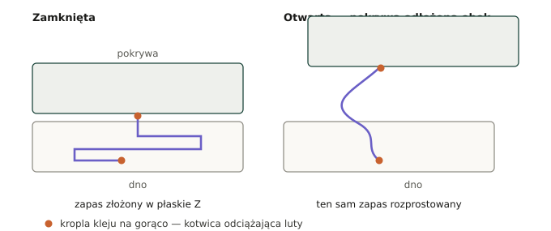
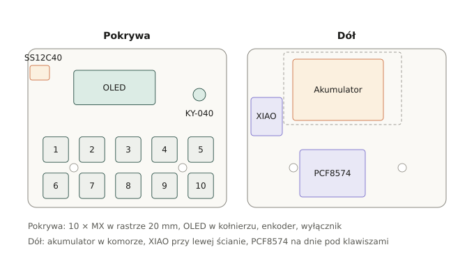

# 04 — Wiązka i otwieranie obudowy

## Skąd bierze się problem

Wszystkie elementy interfejsu siedzą w **pokrywie** (klawisze, OLED, enkoder, wyłącznik),
a cała elektronika w **dnie** (XIAO, PCF8574, akumulator). Obudowa nie ma zawiasu —
skręca się dwiema śrubami M3 i rozdziela całkowicie. Wiązka musi więc przejść przez
podział i wytrzymać każde otwarcie.

## Ile żył przechodzi przez podział

| Grupa | Sztuk |
|---|---|
| Sygnały klawiszy 1–8 (do PCF8574) | 8 |
| Sygnały klawiszy 9–10 (do XIAO) | 2 |
| Wspólna masa klawiszy | 1 |
| Zasilanie modułów w pokrywie (3V3, GND) | 2 |
| I²C do wyświetlacza (SDA, SCL) | 2 |
| Enkoder (CLK, DT, SW) | 3 |
| Wyłącznik (dwa odcinki toru BAT+) | 2 |
| **Razem** | **19** |

## Jak to okiełznać

1. **Przewód silikonowy 30 AWG**, nie PVC. Wielodrutowy silikon jest wiotki; sztywna
   wiązka PVC potrafi sama unieść pokrywę i wyrwać lut.
2. **Sklej żyły w płaską taśmę** — ułóż je obok siebie i owiń wąskim paskiem taśmy
   co ok. 15 mm. Płaska taśma zgina się w jednej płaszczyźnie i sama się układa.
   Okrągły warkocz nie.
3. **Zapas 80–100 mm** ponad długość potrzebną przy zamkniętej obudowie. Tyle wystarczy,
   żeby położyć pokrywę obok dna i dostać się do wszystkich lutów.
4. **Złóż nadmiar w płaskie Z**, nie w kłębek, i wciśnij w wolną przestrzeń nad polem
   klawiszy.
5. **Zakotwicz oba końce** kroplą kleju na gorąco — tam, gdzie taśma wychodzi z pokrywy,
   i tam, gdzie wchodzi w dno. Szarpnięcie idzie wtedy w klej, nie w lut.
6. **Przewody akumulatora prowadź osobno**, przy ściance, w dodatkowej koszulce
   termokurczliwej. Nigdy razem z sygnałami. Przetarcie izolacji na krawędzi wydruku
   to zwarcie ogniwa.
7. **Omijaj słupki śrub** (X −86,58 i −26,58, Y −108,76). Przewód pod słupkiem zostanie
   przecięty przy skręcaniu.
8. **Opcjonalnie:** wstaw w wiązkę złącze JST-PH 2,0 (np. 2 × 10 pin), żeby pokrywę dało
   się całkiem odpiąć. To nie są goldpiny na module — to przerwa serwisowa w samej wiązce.

## Wariant na mniej żył

Zamiana dziesięciu klawiszy na **matrycę 5 × 2** zmniejsza liczbę żył z 19 do 15:
pięć kolumn i dwa wiersze to siedem linii zamiast jedenastu, a przycisk enkodera wchodzi
wtedy na ósmy pin PCF8574 i przestaje przechodzić przez podział.

Koszt: dziesięć diod 1N4148 (po jednej na klawisz, przeciw duchom) i bardziej zakręcony
kod obsługi. Przy dziesięciu klawiszach oszczędność czterech żył raczej nie jest tego
warta — ale jeśli kiedyś rozbudujesz układ, to jest droga do pójścia.

## Rozmieszczenie w obudowie

- **PCF8574** leży płasko na dnie pod polem klawiszy — jest tam ok. 6 mm wolnego pod
  nóżkami MX. Moduł musi leżeć, nie stać.
- **XIAO** w wolnym pasie przy lewej ściance, poniżej wyłącznika, gniazdem USB w stronę
  ścianki (na wypadek, gdybyś kiedyś wyciął w niej otwór).
- **Akumulator** w komorze w górnej części dna, na taśmie dwustronnej. Nie zalewaj go
  klejem — to część eksploatacyjna.
